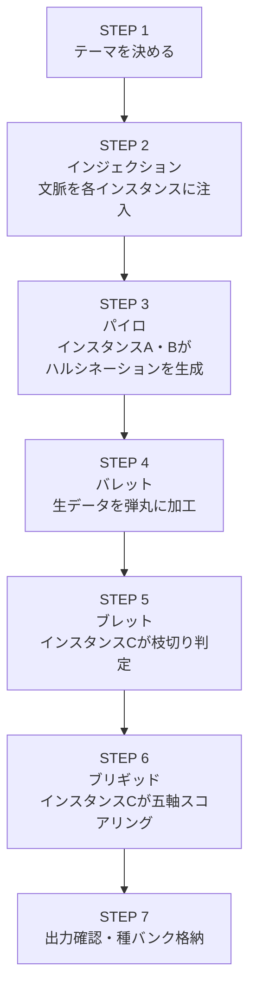

## 付録B — クイックスタートガイド

### B.1 はじめに

本ガイドは、EHARを初めて稼働させるためのステップバイステップの手順書である。本編の設計思想やシステム全体の理解は後からでよい。まずは最小構成でFORGEパイプラインを一周させ、EHARの動作を体感することを目的とする。

---

### B.2 準備するもの

|項目|内容|
|---|---|
|AIチャットインスタンス|最低3つ（生成担当2＋スコアリング担当1）|
|テキストエディタ|種バンク用。メモ帳でもObsidianでもGoogleドライブでも何でもよい|
|本資料|各インスタンスに読み込ませるために使用|
|所要時間の目安|30分〜1時間（手動運用の場合）|

---

### B.3 インスタンスの準備

3つのAIチャットインスタンスを開き、それぞれに以下の役割を割り当てる。

|インスタンス|役割|最初に伝えること|
|---|---|---|
|インスタンスA|ハルシネーション生成担当|「あなたはEHARのパイロ工程を担当します。与えられた文脈に対して、正確さを気にせず自由にアイデアを爆発的に生成してください」|
|インスタンスB|ハルシネーション生成担当|「あなたはEHARのパイロ工程を担当します。与えられた文脈に対して、正確さを気にせず自由にアイデアを爆発的に生成してください」|
|インスタンスC|スコアリング担当|「あなたはEHARのブレット工程とブリギッド工程を担当します。他のインスタンスが生成したハルシネーションに対して、枝切り判定と五軸スコアリングを行ってください」|

各インスタンスには、本資料（または必要な章・付録）を文脈として読み込ませる。最低限、本編の第3章〜第6章と、該当するテンプレート（付録C・D）を共有する。

---

### B.4 FORGEパイプライン実行手順

以下の手順でFORGEパイプラインを一周させる。



#### STEP 1 — テーマを決める

FORGEに投入するテーマを一つ決める。最初は小さく具体的なものがよい。

例：「AIと人間の新しいコミュニケーション形式」「既存の読書体験を根本から変えるアイデア」「料理と音楽を融合させたサービス」

#### STEP 2 — インジェクション

決めたテーマを、インスタンスAとインスタンスBの両方に伝える。この時点で背景情報や制約条件があれば一緒に注入する。

伝える内容の例：

```
【EHAR / FORGEパイプライン — パイロ工程】

テーマ：「AIと人間の新しいコミュニケーション形式」

このテーマについて、正確さは一切不要です。
荒唐無稽でも、非現実的でも、矛盾していても構いません。
思いつく限りのアイデアを、制約なく自由に生成してください。

出力は付録Cのハルシネーション生成テンプレートに従ってください。
```

#### STEP 3 — パイロ

インスタンスAとインスタンスBが、それぞれ独立してハルシネーションを生成する。この段階では各インスタンスの出力を相互に見せない。独立した生成を確保することで、多様性を最大化する。

各インスタンスから付録Cのテンプレートに従った生成シートが出力される。

#### STEP 4 — バレット

インスタンスA・Bから出力された生のハルシネーションを回収し、個別のアイデアとして整理する。一つの出力に複数の概念が混在している場合は、独立したアイデアに切り分ける。この作業は人間が行っても、別のAIインスタンスに依頼してもよい。

#### STEP 5 — ブレット

整理されたアイデア一覧をインスタンスCに渡し、枝切り判定を依頼する。

伝える内容の例：

```
【EHAR / FORGEパイプライン — ブレット工程】

テーマ：「AIと人間の新しいコミュニケーション形式」

以下のアイデアそれぞれについて、
「今の文脈に必要かどうか」のみを基準に、
必要／不要のバイナリ判定を行ってください。

正しいか間違いかでは判断しないでください。
不要と判断したものには、不要と判断した理由を添えてください。

（アイデア一覧を貼り付け）
```

#### STEP 6 — ブリギッド

ブレットを通過したアイデアに対して、インスタンスCに五軸スコアリングを依頼する。付録Dのスコアリングテンプレートを渡し、フォーマットに従った出力を求める。

伝える内容の例：

```
【EHAR / FORGEパイプライン — ブリギッド工程】

ブレットを通過した以下のアイデアについて、
付録Dのスコアリングテンプレートに従い、
五軸スコアリングを実施してください。

五軸：
1. アフィニティ（親和性）        0〜5.0
2. コヒーレンス（一貫性）        0〜5.0
3. ファンクション（作用度）      0〜5.0
4. インパクト（印象度・影響度）  0〜5.0
5. エクステント（程度・広がり）  0〜5.0

各軸のスコアに対する根拠も記載してください。

（通過したアイデア一覧を貼り付け）
```

#### STEP 7 — 出力確認・種バンク格納

ブリギッドのスコアリング結果を確認する。これがFORGEパイプラインの出力である。

同時に、STEP 5で枝切りされたアイデアを、付録Eの種バンク格納テンプレートに従って記録し、テキストエディタに保存する。これが種バンクの第一エントリとなる。

---

### B.5 一周完了後の確認

FORGEパイプラインを一周させたら、以下を確認する。

|確認項目|確認内容|
|---|---|
|出力の確認|ブリギッドを通過したアイデアのスコアプロファイルを見て、五軸の数値がアイデアの性質を適切に表現しているか確認する|
|種バンクの確認|枝切りされたアイデアが、テンプレートに従って記録・保存されているか確認する|
|創発の有無|インスタンスA・Bの個別出力にはなかったが、両者の衝突・交差から生まれた新しい視点や概念がないか確認する。あればそれがエマージェントハルシネーションの芽である|

---

### B.6 次のサイクルに向けて

一周目が完了したら、以下のいずれかの方法で二周目に進むことができる。

|方法|内容|
|---|---|
|テーマを深掘り|同じテーマで、一周目の出力を踏まえた新たな文脈をインジェクションし、FORGEを再走行する|
|種バンクから再注入|一周目で枝切りされたアイデアを種バンクから取り出し、新しい文脈とともにインジェクション工程から再投入する|
|テーマを変更|別のテーマでFORGEを走行し、種バンクの蓄積を増やす。異なるテーマの種バンクエントリ同士を将来的に組み合わせる可能性を意識する|

---

### B.7 よくある最初のつまずき

|つまずき|対処|
|---|---|
|AIが正確な回答をしようとしてハルシネーションを生成しない|「正確さは一切不要です。間違っていても構いません。自由に生成してください」と明示的に伝え直す|
|生成されたアイデアが少なすぎる|「もっと出してください。数量に制限はありません。荒唐無稽なものも歓迎です」と追加で指示する|
|枝切り担当が全部切ってしまう|枝切り基準を再確認させる。「正しいか間違いかではなく、今の文脈に必要かどうかだけで判断してください」と伝え直す|
|スコアリングが全部似たような数値になる|五軸の違いを具体的に説明し直す。特にアフィニティとコヒーレンスの違い（感覚的な馴染みと論理的な一貫性）を強調する|
|何をテーマにすればいいかわからない|今自分が困っていること、興味があること、解決したい課題など、何でもよい。テーマの質よりもまずパイプラインを回すことを優先する|

---
