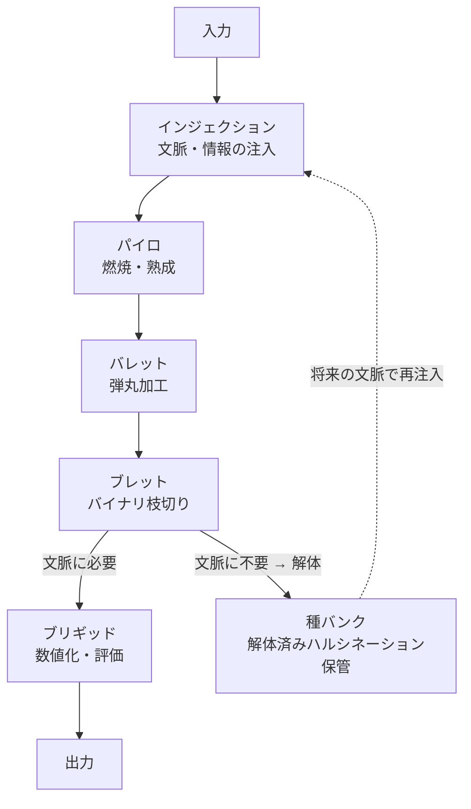

## 第3章.FORGE（フォージ）— パイプライン

FORGEは、EHARの中核を成すパイプラインである。名称は鍛冶場（Forge）に由来し、生の妄想を火で燃やし、叩いて形にし、使える武器に鍛え上げる一連の錬成プロセスを表す。

FORGEは入力から出力までの五つの工程で構成され、各工程が鍛冶の工程と対応する。インジェクションで素材を仕込み、パイロの火で熱し、バレットで弾丸に鍛え、ブレットで品質を判定し、ブリギッドで力を見定める。不要と判断されたものは種バンクに格納され、将来のサイクルで再利用される。

---
