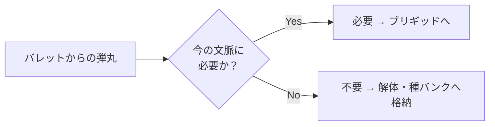

## 第5章.ブレット — 枝切り基準

ブレットにおけるバイナリ枝切りの判定基準は、以下の一点のみである。

> **「今の文脈にそれは必要かどうか」**

正しいか間違いかでは判断しない。間違っていても今の文脈に必要であれば残り、正しくても今の文脈に不要であれば切られる。

この基準が持つ特性は、基準そのものは固定でありながら、「今の文脈」が常に変化するため、同一の基準のもとで判断結果が毎回動的に変わるという点にある。基準の動的更新を必要とせず、運用が自然と動的になる設計である。

また、この基準はどのAIモデルでも即座に判断可能であるという利点を持つ。「このハルシネーションは正しいか」という問いは高度な判断を要するが、「今の文脈にこれは必要か」という問いは任意のモデルが実行可能であり、モジュラー設計との親和性が極めて高い。

枝切りされたハルシネーションは破棄されない。解体された上で、生成時の情報およびスコア情報（評価途中の場合は暫定スコア）とともに種バンクに格納される。文脈が変化した将来のサイクルにおいて、インジェクション工程から再注入され、FORGEパイプラインを再走行する。

---
