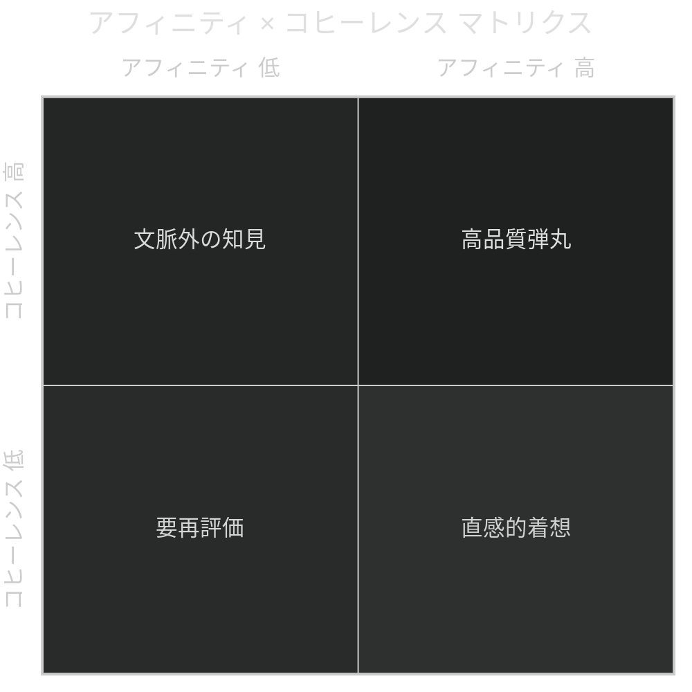

## 第6章.ブリギッド — スコアリングシステム

ブリギッドでは、ブレットを通過したハルシネーションに対して五軸のスコアリングを実施する。各軸は0から5.0の範囲で、小数点を含む連続値で評価される。

### 6.1 五軸定義

|軸|名称|評価内容|スコア範囲|
|---|---|---|---|
|第1軸|**アフィニティ（親和性）**|現在の文脈にどの程度自然に馴染むか|0 〜 5.0|
|第2軸|**コヒーレンス（一貫性）**|現在の文脈と論理的に一貫しているか|0 〜 5.0|
|第3軸|**ファンクション（作用度）**|実際に何かに対して機能・作用するか|0 〜 5.0|
|第4軸|**インパクト（印象度・影響度）**|どれだけ強い印象や影響を与えるか|0 〜 5.0|
|第5軸|**エクステント（程度・広がり）**|アイデアとしてどこまで広がり得るか|0 〜 5.0|

### 6.2 五軸の関係性

五軸はそれぞれ独立した評価基準であり、一つの軸が高くても他の軸が低い場合がある。この多面的な評価により、ハルシネーションの性質を立体的に把握することができる。

特にアフィニティとコヒーレンスの関係は重要である。アフィニティが高くコヒーレンスが低い場合、「文脈に自然と馴染むが論理的には繋がっていない」ことを意味する。これは直感的・感覚的なアイデアが数値として可視化された状態であり、エマージェントハルシネーションの醍醐味とも言える創発的着想が現れている可能性がある。逆にアフィニティが低くコヒーレンスが高い場合、「文脈には馴染まないが論理的には筋が通っている」ことを意味し、現在の文脈の外にある有用な知見が示唆される。

### 6.3 スコアプロファイル例

|例|アフィニティ|コヒーレンス|ファンクション|インパクト|エクステント|解釈|
|---|---|---|---|---|---|---|
|A|4.2|1.3|1.8|4.9|0.3|文脈に馴染み印象は強烈だが、論理的一貫性・実用性・広がりが低い。直感的に刺さる一発屋型|
|B|3.0|4.1|4.5|2.1|4.8|論理的に一貫し実用的で広がりもあるが、印象が弱い。地味だが汎用性の高い実務型|
|C|5.0|5.0|5.0|5.0|5.0|全軸最高。極めて稀な最高品質の弾丸|
|D|0.8|0.5|0.2|4.7|3.9|現在の文脈にはほぼ無関係で論理的にも繋がらないが、インパクトと広がりがある。種バンク格納時の将来再利用価値が高い|
|E|4.5|0.9|3.2|3.8|2.7|文脈に馴染むが論理的根拠が薄い。機能はするしインパクトもある。典型的な創発的着想。コヒーレンスの補強で化ける可能性|

### 6.4 スコアリング原則

スコアリングは、ハルシネーションの生成元とは別のAIインスタンスが担当する。これは自己評価による偏りを排除し、相互監査の原則を維持するためである。

スコアは種バンクに格納される際にもハルシネーション本体とともに記録される。将来の再利用時には、新しい文脈のもとで再スコアリングが行われ、同一のハルシネーションが文脈に応じて異なる評価を受ける。これにより、ハルシネーションを固定的な成果物ではなく、文脈によって価値が変動する動的資産として管理する。

---
