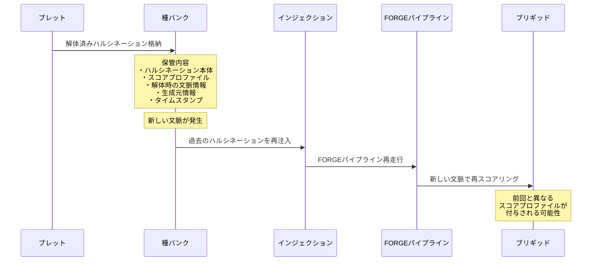

## 第7章.種バンク — 解体済みハルシネーション保管

種バンクは、ブレットで枝切りされたハルシネーションを保管する永続的ストレージである。名称は農業における種子保存に着想を得ており、現在の環境では育たなかったものが将来の環境では大化けする可能性を保全するという思想に基づく。

### 7.1 格納情報

種バンクに格納されるハルシネーションには、以下の情報が付帯する。

|格納項目|内容|
|---|---|
|**ハルシネーション本体**|生成されたアイデア・概念そのもの|
|**スコアプロファイル**|ブリギッドによる五軸スコア（評価途中の場合は暫定値）|
|**解体時の文脈情報**|どのような文脈において不要と判断されたかの記録|
|**生成元情報**|どのAIインスタンスが生成したか|
|**タイムスタンプ**|生成日時・解体日時|

### 7.2 再利用フロー

種バンクに格納されたハルシネーションは、新しい文脈が発生した際にインジェクション工程から再注入される。再注入されたハルシネーションはFORGEパイプラインを最初から再走行し、新しい文脈のもとでブレットの枝切り判定とブリギッドの再スコアリングを受ける。

前回の文脈では不要と判断されたハルシネーションが、新しい文脈では必要と判断されブリギッドを通過する場合がある。また、前回とは異なるスコアプロファイルが付与されることで、同一のハルシネーションに対する評価の時系列変化を追跡することも可能となる。

---
