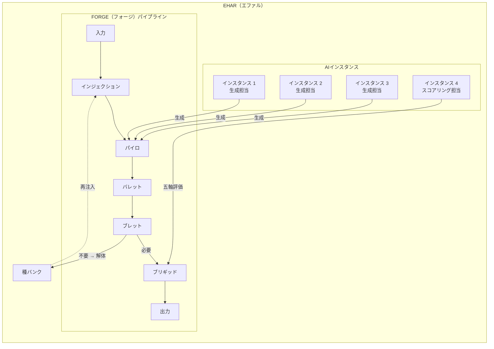

## 第8章.システム全体構成

EHARは、FORGEパイプラインを中核に、複数のAIインスタンスと種バンクで構成される。AIインスタンスはその役割に応じて、ハルシネーション生成担当とスコアリング担当に分かれる。生成担当はパイロ工程でハルシネーションを生成し、スコアリング担当はブリギッド工程で五軸評価を行う。生成とスコアリングを別のインスタンスが担当することで、相互監査の原則を維持する。

以下の構成図は、生成担当3インスタンス＋スコアリング担当1インスタンスの計4インスタンスによる構成例である。最低構成は生成担当2＋スコアリング担当1の計3インスタンスであり、インスタンス数は運用規模に応じて増減できる。

---
