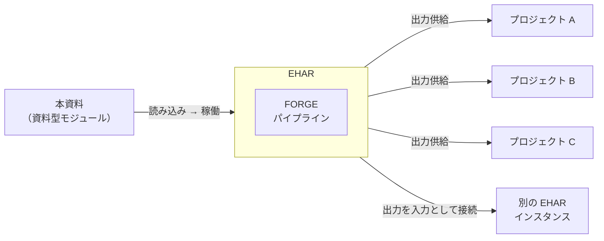

## 第9章. EHARの位置づけ

EHARは独立したシステムとして設計されている。特定のプロジェクト、プラットフォーム、またはワークフローに従属するものではなく、あらゆるプロジェクトに対してアイデアや概念を供給可能な汎用的シンクタンクとして機能する。

EHARから出力された成果物は、任意のプロジェクトやシステムに対して素材として供給できる。また、EHARの出力を別のEHARインスタンスの入力として接続することにより、エマージェントハルシネーションの多段階連鎖を構成することも可能である。

資料型モジュラー設計により、本資料を任意のAIに読み込ませることでEHARのパイプラインを再現・稼働させることができる。EHARの運用に特定のモデルやプラットフォームは要求されず、本資料を理解可能な任意のAIインスタンスがEHARの構成要素となり得る。

---
